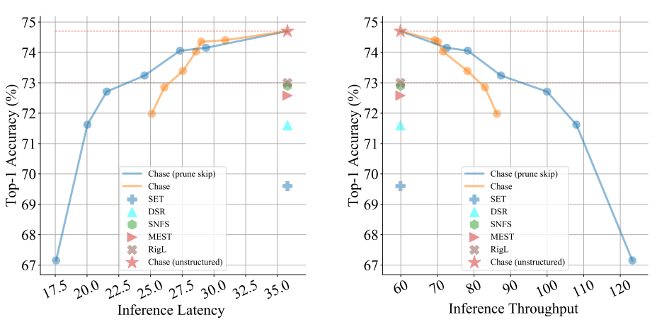

#  [Dynamic Sparsity Is Channel-Level Sparsity Learner](https://arxiv.org/pdf/2305.19454.pdf)

Official PyTorch implementation of  **Chase**: Dynamic Sparsity Is Channel-Level Sparsity Learner

[Lu Yin](https://luuyin.com//), [Gen Li](https://scholar.google.com/citations?user=4nzCXV8AAAAJ), [Meng Fang](https://mengf1.github.io/), [Li Shen](https://scholar.google.com/citations?user=yVhgENIAAAAJ), [Tianjin Huang](https://tienjinhuang.github.io/),  [Zhangyang Wang](https://vita-group.github.io/),[Vlado Menkovsk](https://www.tue.nl/en/research/researchers/vlado-menkovski),[Xiaolong Ma](https://xiaolongma2016.com/),  [Mykola Pechenizkiy](https://www.tue.nl/en/research/researchers/mykola-pechenizkiy), [Shiwei Liu](https://shiweiliuiiiiiii.github.io/)

**Eindhoven University of Technology, University of Texas at Austin, Clemson University, University of Liverpool, JD Explore Academy**


## Table of contents

* [Abstract](#abstract)
* [Results](#Results)
* [Usage](#Usage)
* [Contact](#contact)

## TL;DR
--- 
We propose a new method dubbed Chase, which can effectively transfer the promise of unstructured sparse training into the hardware-friendly channel sparsity with comparable or even better performance on common GPU device.


## Abstract
--- 
Sparse training has received an upsurging interest in machine learning due to its tantalizing saving potential for the entire training process as well as inference. Dynamic sparse training (DST), as a leading sparse training approach, can train deep neural networks at high sparsity from scratch to match the performance of their dense counterparts. However, most if not all DST prior arts demonstrate their effectiveness on unstructured sparsity with highly irregular sparse patterns, which receives limited support in common hardware. This limitation hinders the usage of DST in practice.

In this paper, we propose **Ch**annel-**a**ware dynamic **s**pars**e** (**Chase**), which for the first time seamlessly translates the promise of unstructured dynamic sparsity to GPU-friendly channel-level sparsity (not fine-grained *N:M* or group sparsity) during one end-to-end training process, without any ad-hoc operations. The resulting small sparse networks can be directly accelerated by commodity hardware, without using any particularly sparsity-aware hardware accelerators. This appealing outcome is partially motivated by a hidden phenomenon of dynamic sparsity: *off-the-shelf unstructured DST implicitly involves biased parameter reallocation across channels, with a large fraction of channels (up to 60%) being sparser than others.* By progressively identifying and removing these channels during training, our approach translates unstructured sparsity to channel-wise sparsity.  Our experimental results demonstrate that Chase achieves **1.7×** inference throughput speedup on common GPU devices without compromising accuracy with ResNet-50 on ImageNet.


## Results 
--- 

<p align="center">

</p>

<p style="text-align: center;"><i>Real inference latency and throughput of various DST approaches with the ResNet50/ImageNet benchmark. The sparsity level is 90% for all approaches. In the lines representing Chase and Chase (prune skip), each dot corresponds to a model with distinct channel-wise sparsity</i></p>


| Method                              | Top-1 Accuracy | Theoretical FLOPs (Train) | Theoretical FLOPs (Test) | GPU-Supported FLOPs (Test) | TOP-1 Accuracy | Theoretical FLOPs (Train) | Theoretical FLOPs (Test) | GPU-Supported FLOPs (Test) |
|-------------------------------------|----------------|---------------------------|--------------------------|-----------------------------|----------------|---------------------------|--------------------------|-----------------------------|
| **ResNet-50 (Dense)**               | 76.8±0.09      | 1x (3.2e18)               | 1x (8.2e9)                | 1x (8.2e9)                  | 76.8±0.09      | 1x (3.2e18)               | 1x (8.2e9)                | 1x (8.2e9)                  |
| **Sparsity**                        |                |                           |                          |                             |                |                           |                          |                             |
|                                     | 80%            | 80%                       | 80%                      | 80%                         | 90%            | 90%                       | 90%                      | 90%                         |
| SET [mocanu2018scalable]            | 72.9±0.39      | 0.23×                     | 0.23×                    | 1.00×                       | 69.6±0.23      | 0.10×                     | 0.10×                    | 1.00×                       |
| DSR [mostafa2019parameter]          | 73.3           | 0.40×                     | 0.40×                    | 1.00×                       | 71.6           | 0.30×                     | 0.30×                    | 1.00×                       |
| SNFS [dettmers2019sparse]           | 75.2±0.11      | 0.61×                     | 0.42×                    | 1.00×                       | 72.9±0.06      | 0.50×                     | 0.24×                    | 1.00×                       |
| RigL [evci2020rigging]              | 75.1±0.05      | 0.42×                     | 0.42×                    | 1.00×                       | 73.0±0.04      | 0.25×                     | 0.24×                    | 1.00×                       |
| MEST [yuan2021mest]                 | 75.39          | 0.23×                     | 0.21×                    | 1.00×                       | 72.58          | 0.12×                     | 0.11×                    | 1.00×                       |
| RigL-ITOP [liu2021we]               | 75.84±0.05     | 0.42×                     | 0.42×                    | 1.00×                       | 73.82±0.08     | 0.25×                     | 0.24×                    | 1.00×                       |
| Chase (Sc=0)                       | **75.87**      | 0.37×                     | 0.34×                    | 1.00×                       | **74.70**      | 0.24×                     | 0.21×                    | 1.00×                       |
| Chase (Sc=0.3)                     | 75.62          | 0.39×                     | 0.36×                    | 0.75×                       | 74.35          | 0.25×                     | 0.22×                    | 0.74×                       |
| Chase (Sc=0.4)                     | 75.27          | 0.39×                     | 0.37×                    | 0.68×                       | 74.03          | 0.26×                     | 0.23×                    | 0.67×                       |
| MEST1.5×                           | 75.73          | 0.40×                     | 0.21×                    | 1.00×                       | 75.00          | 0.20×                     | 0.11×                    | 1.00×                       |
| Chase1.5× (Sc=0)                   | **76.67**      | 0.55×                     | 0.34×                    | 1.00×                       | **75.77**      | 0.36×                     | 0.21×                    | 1.00×                       |
| Chase1.5× (Sc=0.3)                 | 76.23          | 0.57×                     | 0.36×                    | 0.75×                       | 75.20          | 0.37×                     | 0.22×                    | 0.74×                       |
| Chase1.5× (Sc=0.4)                 | 76.00          | 0.59×                     | 0.37×                    | 0.68×                       | 74.87          | 0.38×                     | 0.23×                    | 0.67×                       |


## Usage

--- 
We provide a quick overview of the arguments:  
- `--model`: The identifier for the  model to be pruned [`vgg19`,`cifar_resnet_20`,`cifar_resnet_32`,`ResNet34`,`ResNet50`].
- `--start_layer_rate`: The channel level sparsity.
- `--density`: the model density.
- `--layer_interval`: Channel pruning frequency $\Delta T$.
- `--update_frequency`: Parameter Exploring Frequency $\Delta T_p$.
- `--minumum_ratio`: minimum layer limitation factor of &beta;


--- 
### Script example of pruning vgg19 on Cifar100 

```
cd ./Cifar

python3 main_dst_chase.py \
--stop_gmp_epochs  130 \
--minumum_ratio 0.2 \
--gpm_filter_pune \
--mest \
--mest_dst \
--filter_dst \
--mag_wise \
--layer_interval 8000 --start_layer_rate 0.5 \
--sparse \
--indicate_method test \
--model vgg19 --data cifar100 --decay-schedule cosine --seed 41 \
--sparse_init fixed_ERK --update_frequency 1000 --batch-size 100 --death-rate 0.05 \
--growth global_gradients --death global_magnitude  \
--redistribution none --epochs 160 --density 0.1 
```


### Script example of pruning ResNet50 on Cifar100 
```
cd ./Cifar
python3 main_dst_chase.py \
--stop_gmp_epochs  130 \
--minumum_ratio 0.5 \
--gpm_filter_pune \
--mest \
--mest_dst \
--filter_dst \
--comparision \
--mag_wise \
--layer_interval 1000 --start_layer_rate 0.5 \
--new_zero --sparse \
--indicate_method test \
--model ResNet50 --data cifar100 --decay-schedule cosine --seed 41 \
--sparse_init fixed_ERK --update_frequency 1000 --batch-size 100 --death-rate 0.05 \
--growth global_gradients --death global_magnitude  \
--redistribution none --epochs 160 --density 0.1 
```

### Script example of pruning ResNet50 on Imagenet 

```
cd ./Imagenet
model=resnet50
name=Imagenet_resnet50
cycle=2
total_epochs=100
stop_dst_epochs=20
stop_gmp_epochs=80
density=0.1
data=/path/to/imagenet/
python $1multiproc.py --nproc_per_node 4 $main.py --sparse --sparse-init ERK \
        --minumum_ratio 0.2 \
        --mest \
        --mest_dst \
        --filter_dst \
        --mag_wise \
        --cosine_lr \
        --stop_dst_epochs $stop_dst_epochs --stop_gmp_epochs $stop_gmp_epochs\
        --layer_interval 2 --start_layer_rate 0.4  \
        --prune-rate 0.05 \
        --first_m 30 --second_m 60 --third_m 85 \
        --method DST --init-prune-epoch 0 --final-prune-epoch 30 --init-density $density  --final-density $density  \
        --multiplier 1  --seed 17 --master_port 8020 -j72 -p 500 --arch $model -c fanin \
        --update-frequency 1000 --label_smoothing 0.1 -b 128 --lr 0.512 \
        --warmup 8 --density $density  $2 $data --total_epochs $total_epochs  \
        --indicate_method $name 
```

## Contact

Lu Yin: l.yin@tue.nl Homepage: https://luuyin.com/

Shiwei Liu: s.liu3@tue.nl Homepage: https://shiweiliuiiiiiii.github.io/


## Citation
if you find this repo is helpful, please cite

```
@article{yin2023dynamic,
  title={Dynamic Sparsity Is Channel-Level Sparsity Learner},
  author={Yin, Lu and Li, Gen and Fang, Meng and Shen, Li and Huang, Tianjin and Wang, Zhangyang and Menkovski, Vlado and Ma, Xiaolong and Pechenizkiy, Mykola and Liu, Shiwei},
  journal={arXiv preprint arXiv:2305.19454},
  year={2023}
}
```
